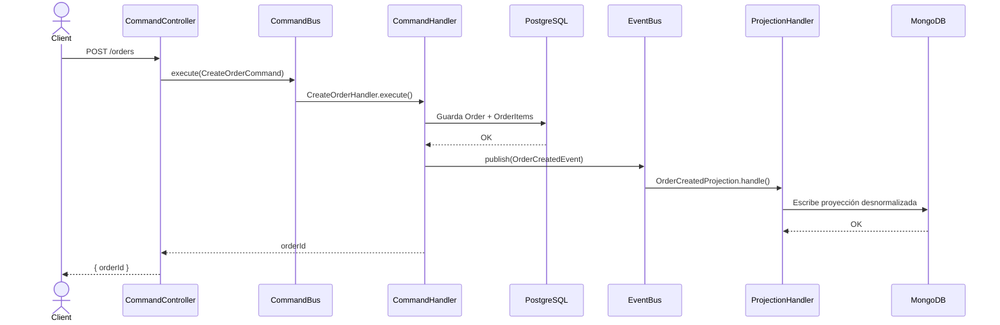
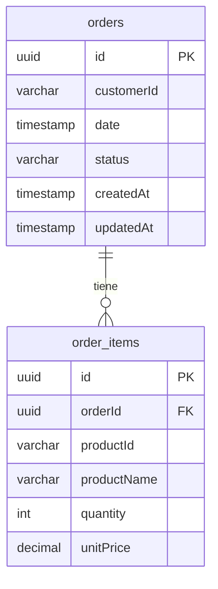
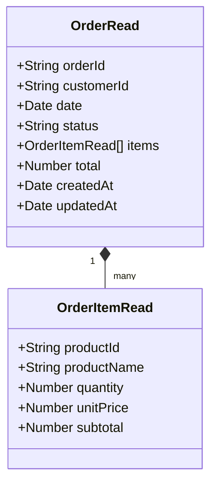
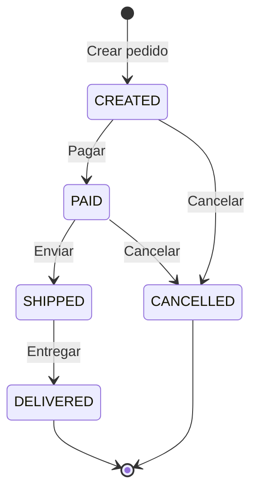

# Order Management CQRS

Prototipo funcional de un módulo de gestión de pedidos aplicando el patrón **CQRS (Command Query Responsibility Segregation)**. Desarrollado con NestJS, utilizando **PostgreSQL** como base de datos de escritura y **MongoDB** como base de datos de lectura.

---

## Contexto

Una plataforma de e-commerce sufre degradación de rendimiento durante campañas de alta demanda porque utiliza un único modelo y una sola base de datos para operaciones de escritura y lectura. Este prototipo resuelve ese problema separando explícitamente ambas responsabilidades.

---

## Patrón CQRS aplicado


---

## Flujo de sincronización Write → Read



---

## Modelo de datos

### Write Model — PostgreSQL



### Read Model — MongoDB



---

## Estados del pedido



> Agregar o eliminar productos solo está permitido en estados **CREATED** y **PAID**.

---

## Endpoints de la API

### Comandos — Escritura

| Método | Ruta | Descripción |
|--------|------|-------------|
| `POST` | `/orders` | Crear un nuevo pedido |
| `PATCH` | `/orders/:id/status` | Cambiar estado del pedido |
| `POST` | `/orders/:id/products` | Agregar producto al pedido |
| `DELETE` | `/orders/:id/products/:productId` | Eliminar producto del pedido |

### Consultas — Lectura

| Método | Ruta | Descripción |
|--------|------|-------------|
| `GET` | `/orders/:id` | Consultar pedido por ID |
| `GET` | `/orders?customerId=X` | Listar pedidos por cliente |
| `GET` | `/orders?status=PAID` | Listar pedidos por estado |
| `GET` | `/orders/summary/sales` | Resumen de ventas |

---

## Estructura del proyecto

```
src/
├── app.module.ts                        # Módulo raíz (TypeORM + Mongoose + Config)
├── main.ts                              # Bootstrap con Swagger y ValidationPipe
│
└── orders/
    ├── orders.module.ts                 # Módulo CQRS de pedidos
    │
    ├── enums/
    │   └── order-status.enum.ts         # Estados: CREATED, PAID, SHIPPED, DELIVERED, CANCELLED
    │
    ├── write-models/                    # Modelo de escritura (PostgreSQL / TypeORM)
    │   ├── order.entity.ts
    │   └── order-item.entity.ts
    │
    ├── read-models/                     # Modelo de lectura (MongoDB / Mongoose)
    │   └── order-read.schema.ts         # Proyección desnormalizada con índices
    │
    ├── commands/
    │   ├── impl/                        # Definición de comandos
    │   │   ├── create-order.command.ts
    │   │   ├── change-order-status.command.ts
    │   │   ├── add-product.command.ts
    │   │   └── remove-product.command.ts
    │   └── handlers/                    # Lógica de escritura + publicación de eventos
    │       ├── create-order.handler.ts
    │       ├── change-order-status.handler.ts
    │       ├── add-product.handler.ts
    │       └── remove-product.handler.ts
    │
    ├── events/
    │   ├── impl/                        # Definición de eventos de dominio
    │   │   ├── order-created.event.ts
    │   │   ├── order-status-changed.event.ts
    │   │   ├── product-added.event.ts
    │   │   └── product-removed.event.ts
    │   └── handlers/                    # Proyecciones: sincronizan PostgreSQL → MongoDB
    │       ├── order-created.handler.ts
    │       ├── order-status-changed.handler.ts
    │       ├── product-added.handler.ts
    │       └── product-removed.handler.ts
    │
    ├── queries/
    │   ├── impl/                        # Definición de queries
    │   │   ├── get-order-by-id.query.ts
    │   │   ├── list-orders-by-customer.query.ts
    │   │   ├── list-orders-by-status.query.ts
    │   │   └── get-sales-summary.query.ts
    │   └── handlers/                    # Lógica de lectura desde MongoDB
    │       ├── get-order-by-id.handler.ts
    │       ├── list-orders-by-customer.handler.ts
    │       ├── list-orders-by-status.handler.ts
    │       └── get-sales-summary.handler.ts
    │
    ├── dto/                             # Validación de entrada (class-validator)
    │   ├── create-order.dto.ts
    │   ├── change-status.dto.ts
    │   └── add-product.dto.ts
    │
    └── controllers/
        ├── orders-command.controller.ts # Endpoints de escritura (POST, PATCH, DELETE)
        └── orders-query.controller.ts   # Endpoints de lectura (GET)
```

---

## Stack tecnológico

| Componente | Tecnología |
|-----------|------------|
| Framework | NestJS 11 |
| Lenguaje | TypeScript |
| Patrón CQRS | `@nestjs/cqrs` |
| Base de datos escritura | PostgreSQL 15 (TypeORM) |
| Base de datos lectura | MongoDB 7 (Mongoose) |
| Validación | class-validator + class-transformer |
| Documentación API | Swagger (`@nestjs/swagger`) |
| Contenedores | Docker + Docker Compose |

---

## Requisitos previos

- Node.js >= 18
- Docker y Docker Compose

---

## Cómo correr el proyecto

### 1. Levantar las bases de datos

```bash
docker-compose up -d
```

Esto inicia:
- **PostgreSQL** en `localhost:5432` (base: `orders_write`)
- **MongoDB** en `localhost:27017` (base: `orders_read`)

### 2. Configurar variables de entorno

El archivo `.env` ya está incluido con los valores por defecto:

```env
PORT=3000

POSTGRES_HOST=localhost
POSTGRES_PORT=5432
POSTGRES_USER=postgres
POSTGRES_PASSWORD=postgres
POSTGRES_DB=orders_write

MONGODB_URI=mongodb://localhost:27017/orders_read
```

### 3. Instalar dependencias

```bash
npm install
```

### 4. Iniciar la aplicación

```bash
# Desarrollo (watch mode)
npm run start:dev

# Producción
npm run build
npm run start:prod
```

La API estará disponible en `http://localhost:3000`.  
La documentación Swagger en `http://localhost:3000/api`.

---

## Ejemplos de uso

### Crear un pedido

```bash
POST /orders
Content-Type: application/json

{
  "customerId": "cust-001",
  "date": "2024-04-08",
  "items": [
    {
      "productId": "prod-001",
      "productName": "Laptop",
      "quantity": 1,
      "unitPrice": 1299.99
    },
    {
      "productId": "prod-002",
      "productName": "Mouse Inalámbrico",
      "quantity": 2,
      "unitPrice": 29.99
    }
  ]
}
```

### Cambiar estado

```bash
PATCH /orders/{id}/status
Content-Type: application/json

{ "status": "PAID" }
```

### Agregar producto

```bash
POST /orders/{id}/products
Content-Type: application/json

{
  "productId": "prod-003",
  "productName": "Teclado Mecánico",
  "quantity": 1,
  "unitPrice": 89.99
}
```

### Consultar resumen de ventas

```bash
GET /orders/summary/sales
```

```json
{
  "totalOrders": 42,
  "totalRevenue": 58320.50,
  "topProducts": [
    { "productId": "prod-001", "productName": "Laptop", "totalQuantity": 18 },
    { "productId": "prod-002", "productName": "Mouse Inalámbrico", "totalQuantity": 35 }
  ]
}
```

---

## Clientes recomendados para las bases de datos

| Base de datos | Cliente recomendado |
|--------------|---------------------|
| PostgreSQL | [TablePlus](https://tableplus.com) / [DBeaver](https://dbeaver.io) |
| MongoDB | [MongoDB Compass](https://www.mongodb.com/try/download/compass) |

**Conexión PostgreSQL:** host `localhost`, puerto `5432`, base `orders_write`, usuario `postgres`  
**Conexión MongoDB:** `mongodb://localhost:27017` → base `orders_read`
