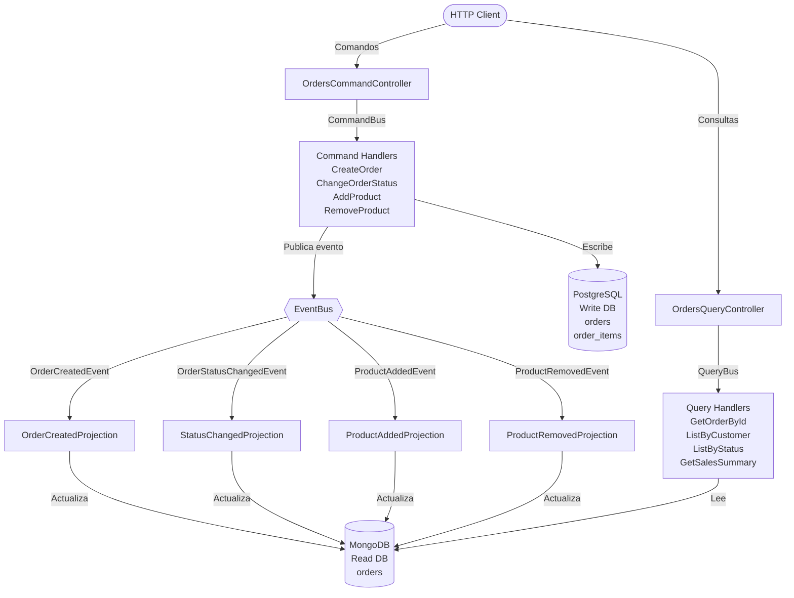
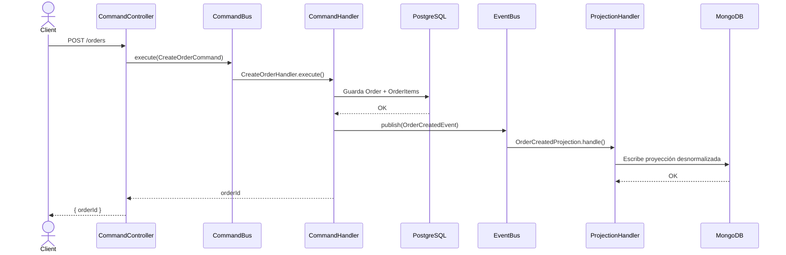
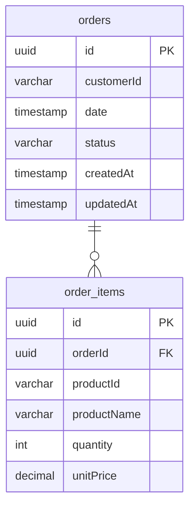
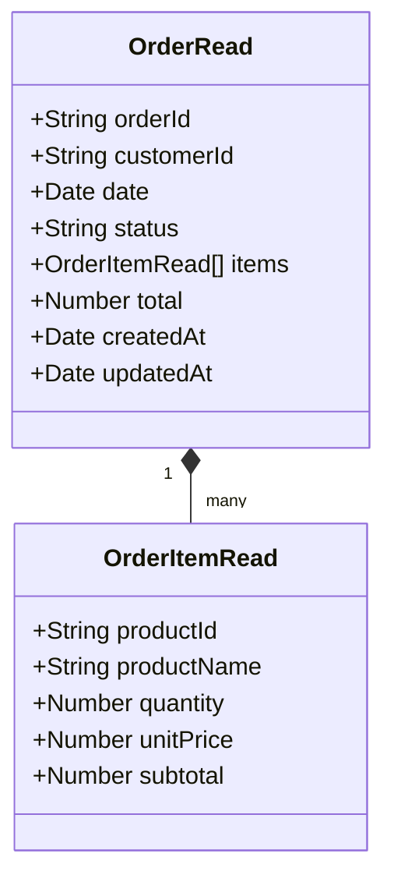
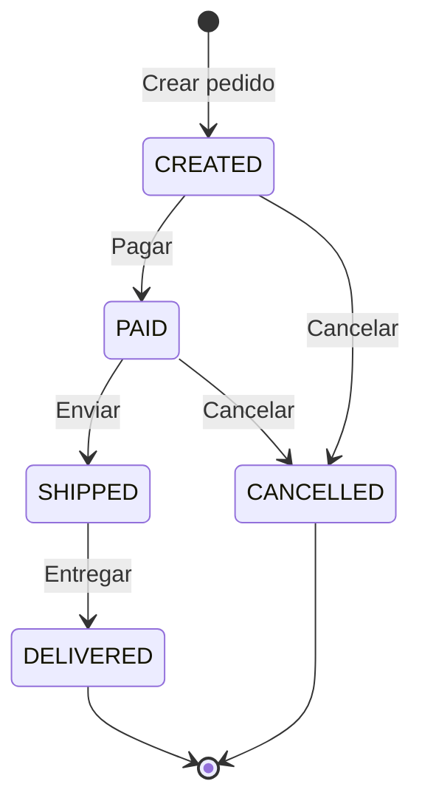

# Order Management CQRS

Prototipo funcional de un módulo de gestión de pedidos aplicando el patrón **CQRS (Command Query Responsibility Segregation)**. Desarrollado con NestJS, utilizando **PostgreSQL** como base de datos de escritura y **MongoDB** como base de datos de lectura.

---

## Descripción del problema

Una plataforma de e-commerce en crecimiento presenta degradación de rendimiento durante campañas promocionales y temporadas de alta demanda. El sistema actual opera con un **único modelo de datos y una sola base de datos** que atiende simultáneamente operaciones de escritura y lectura, generando los siguientes problemas:

- **Contención en escrituras:** al crear o actualizar pedidos se bloquean recursos que también necesitan las lecturas.
- **Consultas lentas:** las consultas administrativas (ventas por estado, productos más vendidos) compiten con las transacciones de negocio.
- **Escalabilidad limitada:** no es posible escalar independientemente la carga de lectura de la de escritura.
- **Modelo de datos comprometido:** el mismo esquema debe servir tanto para garantizar integridad transaccional como para responder consultas analíticas rápidas, objetivos que son difíciles de cumplir a la vez.

### Solución propuesta

Aplicar el patrón **CQRS** para separar explícitamente las responsabilidades de escritura y lectura, utilizando:

- **PostgreSQL** como base de datos transaccional para escrituras (modelo normalizado, ACID).
- **MongoDB** como base de datos de lectura (modelo desnormalizado, optimizado para consultas).
- **Eventos de dominio** para mantener ambos modelos sincronizados de forma inmediata.

---

## Arquitectura propuesta

El sistema aplica CQRS dividiendo cada operación en dos caminos completamente independientes:

- **Lado de escritura (Command side):** recibe comandos que modifican el estado del sistema. Cada comando es validado, ejecutado por su handler, persistido en PostgreSQL y finaliza publicando un evento de dominio que notifica el cambio ocurrido.
- **Lado de lectura (Query side):** recibe consultas que nunca modifican estado. Los handlers leen directamente desde MongoDB, que mantiene los datos en la forma exacta en que serán consumidos, sin necesidad de joins ni transformaciones.
- **Capa de proyección:** son los event handlers que escuchan los eventos publicados por el lado de escritura y actualizan MongoDB en tiempo real. Esta capa es el puente que mantiene ambos modelos sincronizados.

Esta separación permite que ambos lados evolucionen, escalen y se optimicen de forma independiente.

---

## Patrón CQRS aplicado



---

## Justificación de las bases de datos

### PostgreSQL — Base de datos de escritura

PostgreSQL es una base de datos relacional con soporte completo de **ACID** (Atomicidad, Consistencia, Aislamiento, Durabilidad), lo que la hace ideal para el lado de escritura porque:

- Garantiza **integridad referencial** entre pedidos e ítems mediante claves foráneas.
- Permite **transacciones atómicas**: si una orden falla a mitad de guardado, se revierte completamente.
- El modelo **normalizado** (tablas separadas `orders` y `order_items`) evita duplicación de datos y facilita actualizaciones consistentes.
- Las **validaciones de negocio** (transiciones de estado, restricciones) se aplican antes de persistir, asegurando que solo datos válidos lleguen a la base.

### MongoDB — Base de datos de lectura

MongoDB es una base de datos documental orientada a **consultas flexibles y de alta performance**, ideal para el lado de lectura porque:

- Almacena cada pedido como un **documento embebido** con sus ítems y totales precalculados, eliminando la necesidad de joins al consultar.
- Los **índices compuestos** sobre `orderId`, `customerId` y `status` permiten búsquedas en O(log n) sin escaneo completo de la colección.
- El **aggregation pipeline** nativo permite calcular resúmenes de ventas y rankings de productos de forma eficiente en una sola operación.
- El esquema flexible permite **adaptar la proyección** a las necesidades de lectura sin afectar el modelo de escritura.

---

## Flujo de sincronización Write → Read



---

### Mecanismo de sincronización

La sincronización entre ambas bases es **inmediata y sincrónica** dentro del mismo proceso. El flujo exacto es:

1. El `CommandHandler` ejecuta la lógica de negocio y persiste en PostgreSQL.
2. Inmediatamente después publica un **evento de dominio** en el `EventBus` (ej: `OrderCreatedEvent`).
3. El `EventBus` de `@nestjs/cqrs` invoca al `ProjectionHandler` correspondiente en el mismo ciclo de ejecución.
4. El `ProjectionHandler` transforma los datos del evento al formato del modelo de lectura y los escribe en MongoDB.

Cada evento tiene su projection handler dedicado:

| Evento | Projection Handler | Operación en MongoDB |
|--------|-------------------|----------------------|
| `OrderCreatedEvent` | `OrderCreatedProjection` | `insertOne` con documento completo |
| `OrderStatusChangedEvent` | `OrderStatusChangedProjection` | `updateOne` → campo `status` |
| `ProductAddedEvent` | `ProductAddedProjection` | `updateOne` → array `items` + `total` |
| `ProductRemovedEvent` | `ProductRemovedProjection` | `updateOne` → array `items` + `total` |

> Si la escritura en MongoDB falla, el dato ya fue persistido en PostgreSQL. En un sistema productivo se recomienda implementar un mecanismo de reintento o un outbox pattern para garantizar la consistencia eventual.

---

## Modelo de datos

### Write Model — PostgreSQL



### Read Model — MongoDB



---

## Estados del pedido



> Agregar o eliminar productos solo está permitido en estados **CREATED** y **PAID**.

---

## Comandos y consultas

### Comandos — Escritura

Los comandos representan intenciones de cambio de estado. Cada uno es manejado por un handler dedicado que escribe en PostgreSQL y publica un evento de dominio.

| Método | Ruta | Comando | Descripción |
|--------|------|---------|-------------|
| `POST` | `/orders` | `CreateOrderCommand` | Crea un pedido con cliente, fecha e ítems. El estado inicial es siempre `CREATED`. |
| `PATCH` | `/orders/:id/status` | `ChangeOrderStatusCommand` | Transiciona el estado del pedido. Valida que la transición sea permitida. |
| `POST` | `/orders/:id/products` | `AddProductCommand` | Agrega un producto al pedido. Solo permitido en estados `CREATED` y `PAID`. |
| `DELETE` | `/orders/:id/products/:productId` | `RemoveProductCommand` | Elimina un producto del pedido. Solo permitido en estados `CREATED` y `PAID`. |

### Consultas — Lectura

Las consultas son operaciones de solo lectura que nunca modifican el estado del sistema. Leen siempre desde MongoDB, la base de datos optimizada para este fin.

| Método | Ruta | Query | Descripción |
|--------|------|-------|-------------|
| `GET` | `/orders/:id` | `GetOrderByIdQuery` | Retorna el pedido completo con sus ítems y total calculado. |
| `GET` | `/orders?customerId=X` | `ListOrdersByCustomerQuery` | Lista todos los pedidos de un cliente, ordenados por fecha. |
| `GET` | `/orders?status=PAID` | `ListOrdersByStatusQuery` | Lista todos los pedidos en un estado determinado. |
| `GET` | `/orders/summary/sales` | `GetSalesSummaryQuery` | Retorna el total de pedidos, ingresos acumulados y los 10 productos más solicitados. Calculado con aggregation pipeline de MongoDB. |

---

## Beneficios y trade-offs

### Beneficios

| Beneficio | Explicación |
|-----------|-------------|
| **Escalabilidad independiente** | El servicio de lectura puede escalarse horizontalmente sin afectar el de escritura, y viceversa. |
| **Rendimiento de lectura** | MongoDB sirve documentos precalculados sin joins, reduciendo drásticamente la latencia en consultas. |
| **Modelo optimizado por propósito** | PostgreSQL garantiza integridad transaccional; MongoDB optimiza velocidad de consulta. Cada base hace lo que mejor sabe hacer. |
| **Consultas analíticas eficientes** | El aggregation pipeline de MongoDB permite calcular resúmenes complejos (ventas, rankings) en una sola operación, sin impactar las escrituras. |
| **Separación de responsabilidades** | Comandos y queries son completamente independientes: pueden ser desarrollados, desplegados y mantenidos por equipos separados. |
| **Historial de cambios via eventos** | Los eventos de dominio pueden ser almacenados (Event Sourcing) para auditoría o para reconstruir el estado en cualquier punto del tiempo. |

### Trade-offs

| Trade-off | Explicación |
|-----------|-------------|
| **Complejidad operacional** | Mantener dos bases de datos implica más infraestructura, monitoreo y operaciones de backup. |
| **Consistencia eventual** | Existe una ventana de tiempo (mínima en este caso, pero no cero) entre que se escribe en PostgreSQL y se actualiza MongoDB. |
| **Duplicación de datos** | Los datos existen en dos lugares simultáneamente, lo que aumenta el uso de almacenamiento. |
| **Mayor cantidad de código** | CQRS requiere definir comandos, queries, eventos, handlers y projections por separado. Más archivos para mantener. |
| **Sincronización sin garantía transaccional** | La escritura en PostgreSQL y la actualización en MongoDB no ocurren en la misma transacción distribuida. Un fallo entre ambas puede dejar el sistema inconsistente temporalmente. |
| **Curva de aprendizaje** | El patrón no es inmediatamente intuitivo para desarrolladores que no lo conocen. |

> **Conclusión:** CQRS es una solución adecuada cuando los patrones de lectura y escritura difieren significativamente en volumen, frecuencia o forma. Para sistemas pequeños con baja carga, la complejidad adicional puede no justificarse.

---

## Estructura del proyecto

```
src/
├── app.module.ts                        # Módulo raíz (TypeORM + Mongoose + Config)
├── main.ts                              # Bootstrap con Swagger y ValidationPipe
│
└── orders/
    ├── orders.module.ts                 # Módulo CQRS de pedidos
    │
    ├── common/                          # Elementos compartidos del dominio
    │   └── enums/
    │       └── order-status.enum.ts     # Estados: CREATED, PAID, SHIPPED, DELIVERED, CANCELLED
    │
    ├── models/                          # Modelos de datos de ambas bases
    │   ├── write-models/                # Entidades TypeORM → PostgreSQL
    │   │   ├── order.entity.ts
    │   │   └── order-item.entity.ts
    │   └── read-models/                 # Schemas Mongoose → MongoDB
    │       └── order-read.schema.ts     # Proyección desnormalizada con índices
    │
    ├── application/                     # Casos de uso CQRS
    │   ├── commands/
    │   │   ├── impl/                    # Definición de comandos
    │   │   │   ├── create-order.command.ts
    │   │   │   ├── change-order-status.command.ts
    │   │   │   ├── add-product.command.ts
    │   │   │   └── remove-product.command.ts
    │   │   └── handlers/                # Lógica de escritura + publicación de eventos
    │   │       ├── create-order.handler.ts
    │   │       ├── change-order-status.handler.ts
    │   │       ├── add-product.handler.ts
    │   │       └── remove-product.handler.ts
    │   ├── events/
    │   │   ├── impl/                    # Definición de eventos de dominio
    │   │   │   ├── order-created.event.ts
    │   │   │   ├── order-status-changed.event.ts
    │   │   │   ├── product-added.event.ts
    │   │   │   └── product-removed.event.ts
    │   │   └── handlers/                # Proyecciones: sincronizan PostgreSQL → MongoDB
    │   │       ├── order-created.handler.ts
    │   │       ├── order-status-changed.handler.ts
    │   │       ├── product-added.handler.ts
    │   │       └── product-removed.handler.ts
    │   └── queries/
    │       ├── impl/                    # Definición de queries
    │       │   ├── get-order-by-id.query.ts
    │       │   ├── list-orders-by-customer.query.ts
    │       │   ├── list-orders-by-status.query.ts
    │       │   └── get-sales-summary.query.ts
    │       └── handlers/                # Lógica de lectura desde MongoDB
    │           ├── get-order-by-id.handler.ts
    │           ├── list-orders-by-customer.handler.ts
    │           ├── list-orders-by-status.handler.ts
    │           └── get-sales-summary.handler.ts
    │
    └── http/                            # Capa de entrada HTTP
        ├── controllers/
        │   ├── orders-command.controller.ts  # Endpoints de escritura (POST, PATCH, DELETE)
        │   └── orders-query.controller.ts    # Endpoints de lectura (GET)
        └── dto/                         # Validación de entrada (class-validator)
            ├── create-order.dto.ts
            ├── change-status.dto.ts
            └── add-product.dto.ts
```

---

## Stack tecnológico

| Componente | Tecnología |
|-----------|------------|
| Framework | NestJS 11 |
| Lenguaje | TypeScript |
| Patrón CQRS | `@nestjs/cqrs` |
| Base de datos escritura | PostgreSQL 15 (TypeORM) |
| Base de datos lectura | MongoDB 7 (Mongoose) |
| Validación | class-validator + class-transformer |
| Documentación API | Swagger (`@nestjs/swagger`) |
| Contenedores | Docker + Docker Compose |

---

## Requisitos previos

- Node.js >= 18
- Docker y Docker Compose

---

## Cómo correr el proyecto

### 1. Levantar las bases de datos

```bash
docker-compose up -d
```

Esto inicia:
- **PostgreSQL** en `localhost:5432` (base: `orders_write`)
- **MongoDB** en `localhost:27017` (base: `orders_read`)

### 2. Configurar variables de entorno

El archivo `.env` ya está incluido con los valores por defecto:

```env
PORT=3000

POSTGRES_HOST=localhost
POSTGRES_PORT=5432
POSTGRES_USER=postgres
POSTGRES_PASSWORD=postgres
POSTGRES_DB=orders_write

MONGODB_URI=mongodb://localhost:27017/orders_read
```

### 3. Instalar dependencias

```bash
npm install
```

### 4. Iniciar la aplicación

```bash
# Desarrollo (watch mode)
npm run start:dev

# Producción
npm run build
npm run start:prod
```

La API estará disponible en `http://localhost:3000`.  
La documentación Swagger en `http://localhost:3000/api`.

---

## Ejemplos de uso

### Crear un pedido

```bash
POST /orders
Content-Type: application/json

{
  "customerId": "cust-001",
  "date": "2024-04-08",
  "items": [
    {
      "productId": "prod-001",
      "productName": "Laptop",
      "quantity": 1,
      "unitPrice": 1299.99
    },
    {
      "productId": "prod-002",
      "productName": "Mouse Inalámbrico",
      "quantity": 2,
      "unitPrice": 29.99
    }
  ]
}
```

### Cambiar estado

```bash
PATCH /orders/{id}/status
Content-Type: application/json

{ "status": "PAID" }
```

### Agregar producto

```bash
POST /orders/{id}/products
Content-Type: application/json

{
  "productId": "prod-003",
  "productName": "Teclado Mecánico",
  "quantity": 1,
  "unitPrice": 89.99
}
```

### Consultar resumen de ventas

```bash
GET /orders/summary/sales
```

```json
{
  "totalOrders": 42,
  "totalRevenue": 58320.50,
  "topProducts": [
    { "productId": "prod-001", "productName": "Laptop", "totalQuantity": 18 },
    { "productId": "prod-002", "productName": "Mouse Inalámbrico", "totalQuantity": 35 }
  ]
}
```

---

## Clientes recomendados para las bases de datos

| Base de datos | Cliente recomendado |
|--------------|---------------------|
| PostgreSQL | [TablePlus](https://tableplus.com) / [DBeaver](https://dbeaver.io) |
| MongoDB | [MongoDB Compass](https://www.mongodb.com/try/download/compass) |

**Conexión PostgreSQL:** host `localhost`, puerto `5432`, base `orders_write`, usuario `postgres`  
**Conexión MongoDB:** `mongodb://localhost:27017` → base `orders_read`
